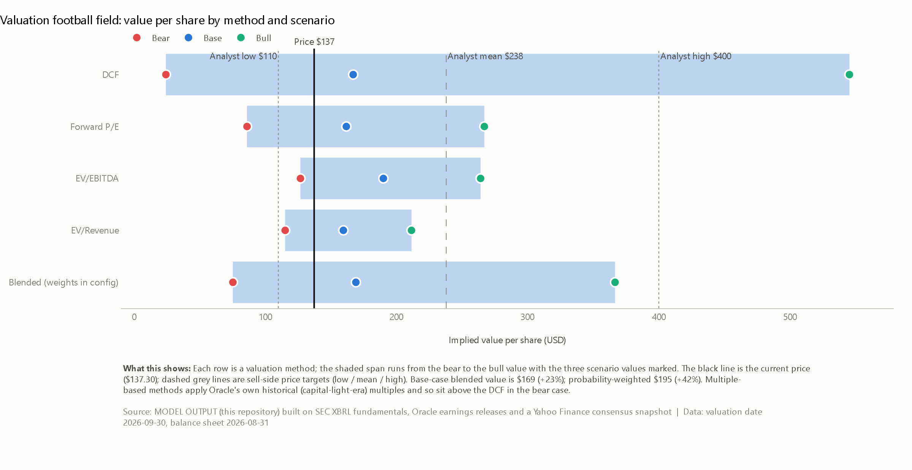
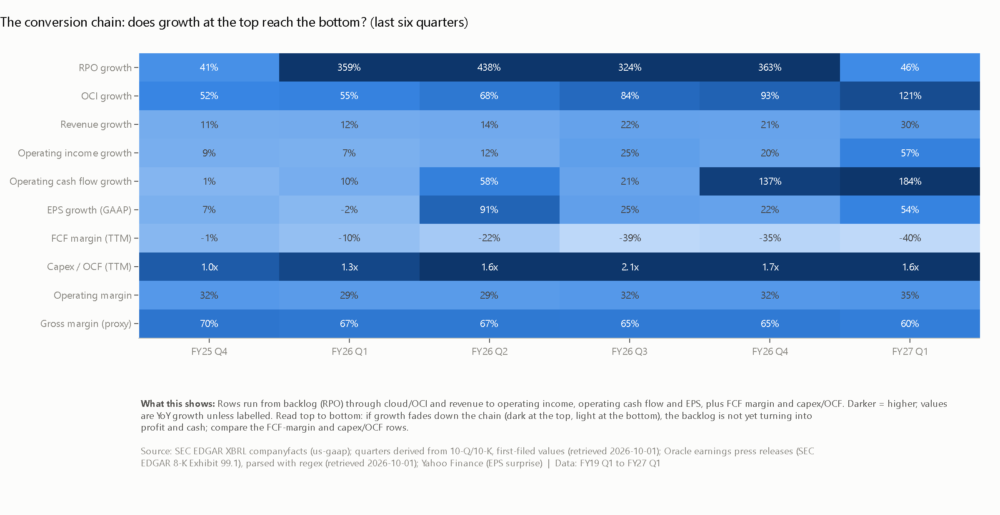
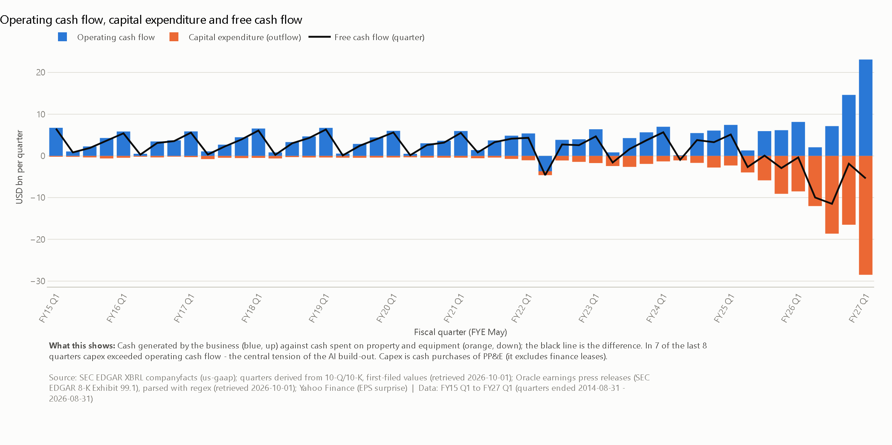
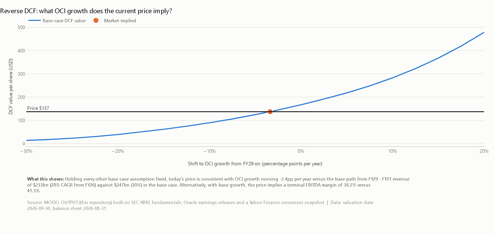
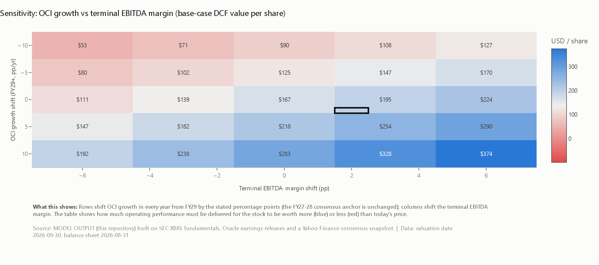
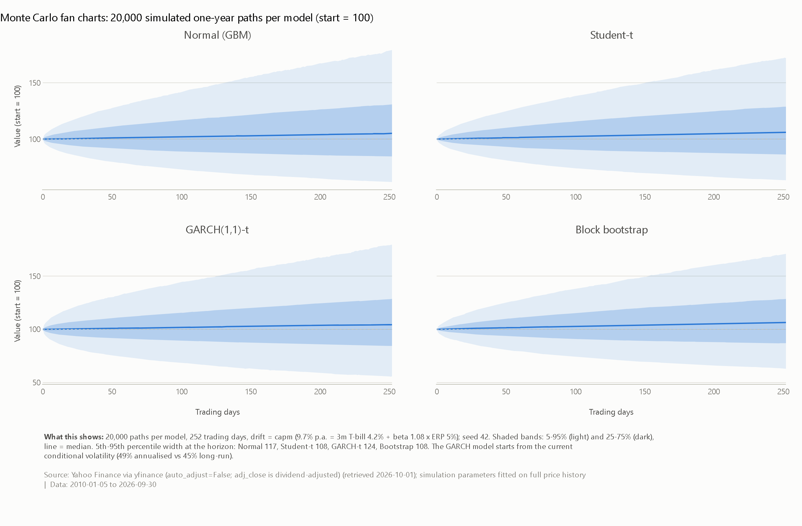
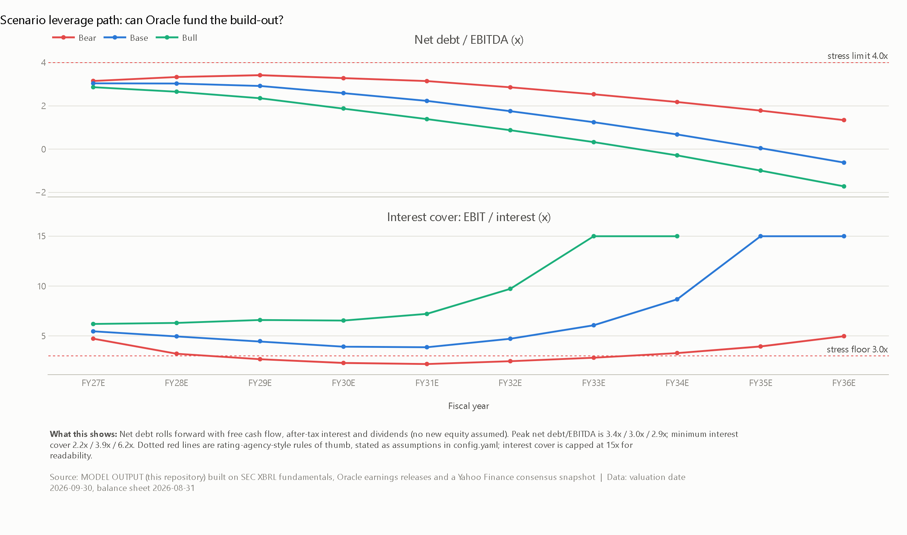
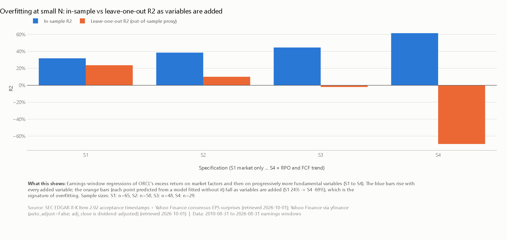
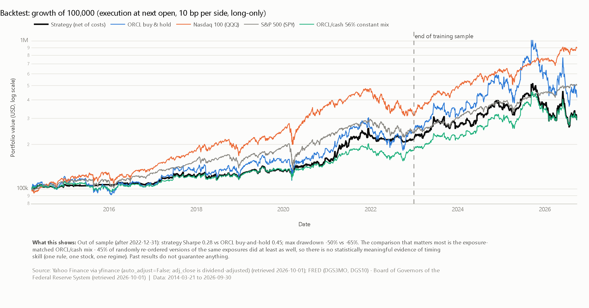

# ORCL Quantitative Investment & AI Valuation Lab

An institutional-style equity-research and quantitative-research project on **Oracle Corporation (NYSE: ORCL)**, built end to end in Python: a reproducible data pipeline, financial modelling, a four-method valuation engine with bear/base/bull scenarios, a risk engine with Monte Carlo, statistical factor models, an earnings event study, a transparent investment score, an honestly-backtested experimental signal, a nine-page Streamlit dashboard and an auto-generated research report.

> **Central research question.** *Can Oracle's AI/cloud growth justify its valuation and rapidly increasing capital requirements, and what does a quantitative model imply about the stock's expected risk/reward?*

**This is not a stock-prediction project.** There is no "AI predicts Oracle's price" model and no accuracy claim. Where the evidence shows no edge, the project says so. Educational research only - not investment advice.

---

## Headline results (data as of the 2026-09-30 close, latest quarter FY27 Q1)

| | |
|---|---|
| Price | **$137.30** |
| Scenario-implied value (bear / base / bull, blended) | **$75 / $169 / $367** (base +23%, probability-weighted $195) |
| Reverse DCF | the price is consistent with OCI growth ~3.4pp a year *below* the base path from FY29, or a terminal EBITDA margin of ~38% vs 41% |
| Growth -> cash? | revenue +30% YoY, OCI +121%, operating cash flow +184% - but **trailing FCF margin -40%** (capex 1.6x operating cash flow) |
| Backlog (RPO) | $664bn, 9.3x trailing revenue |
| Balance sheet | net debt/EBITDA 2.6x; the bear-case path breaches a 3x interest-cover floor (min 2.2x) |
| Quantitative score | **38 / 100** (growth near the top of Oracle's own history; momentum and market risk near the bottom) |
| Out-of-sample prediction | OOS R² **-3.5%** vs a constant forecast (Diebold-Mariano p = 0.53) - no predictability found |
| Experimental signal backtest | out-of-sample Sharpe 0.28 vs 0.45 buy-and-hold; placebo p = 0.45 - **no demonstrable timing skill** |
| **Model-driven conclusion** | **Neutral** (five fixed-rule votes: valuation +1, signal +1, score -1, cash conversion -1, balance sheet 0) |

Full write-up: [`reports/orcl_research_report.md`](reports/orcl_research_report.md) (generated by the code from the analysis results; it answers the nine questions in the brief and ends with the conclusion).



---

## Methodology

**Research -> data -> methodology -> evidence -> conclusion.**

1. **Data (reproducible, sourced, dated).** Prices (Yahoo Finance via `yfinance`), risk-free rates (FRED), financial statements (SEC EDGAR XBRL `companyfacts`), earnings dates/timestamps and cloud/OCI/guidance KPIs (SEC 8-K earnings releases, parsed), analyst consensus (dated Yahoo snapshot), hyperscaler peers' PP&E and margins. Every dataset is recorded in `data/manifest.json` with source, retrieval time, hash and a **kind**: `HISTORICAL`, `CONSENSUS` (forecast), `ASSUMPTION`, `MODEL` - so data, forecasts, assumptions and outputs are never confused.
2. **Fundamentals.** Quarters are derived from cumulative 10-Q/10-K data (Q4 = FY - 9M; Oracle mis-tags some full-year values as "Q4" so standalone Q4 facts are never trusted). First-filed values keep the data point-in-time; each quarter has an `avail_date` = the session that first reflected the release. Hard validation checks (income-statement identity, quarters sum to fiscal years) run on every build.
3. **RPO -> Revenue -> Cash-flow framework.** Growth correlations, lead-lag analysis with effective-sample-size-adjusted confidence intervals, Granger-type test, forward conversion ratios, capital-efficiency analysis - with explicit limitations (28 quarters, one structural break).
4. **Valuation.** Forward P/E, EV/EBITDA, EV/Revenue and a DCF. Revenue is a three-segment model (OCI, SaaS, other) anchored to consensus low/mean/high for FY27-28; EBITDA margin, capital intensity (net PP&E/revenue, anchored to Microsoft/Alphabet/Amazon), depreciation, working capital, tax and financing are explicit; capex is whatever is needed to hold PP&E on its path as revenue grows. **Every assumption is traced to `DATA`, `CONSENSUS` or `SCENARIO`** in `models/valuation_assumption_log.csv`. Sensitivity tables: WACC x terminal growth, OCI growth x margin, OCI growth x exit multiple. Plus a reverse DCF.
5. **Risk.** Historical, parametric (normal, Student-t, Cornish-Fisher where valid) VaR/ES, VaR backtests (Kupiec, Christoffersen), 20,000-path Monte Carlo under normal, Student-t, GARCH(1,1)-t and block-bootstrap models - showing why a normal distribution understates ORCL's tail risk (excess kurtosis 33; 14 days beyond -4σ vs 0.13 expected).
6. **Statistical models.** Daily factor attribution (OLS with HAC errors, VIF, rolling regression, train/test); earnings-window regressions showing in-sample R² rising while leave-one-out R² collapses (overfitting); regularised walk-forward prediction with purged training windows, permutation importance and a Diebold-Mariano test.
7. **Event study.** Market-model abnormal returns for 1/3/5/20 days around 62 earnings releases; cross-sectional tests with robust errors, permutation p-values and influence diagnostics.
8. **Score and signal.** 0-100 score from expanding-window percentile ranks (weights configurable, *not optimised*), weight-robustness test, "why it could fail" analysis; an experimental five-state signal with thresholds from the training sample only, next-open execution, transaction costs, placebo and bootstrap tests.

## Key findings

- **Growth is real and reaches profit and operating cash flow, but not free cash flow.** The build-out is funded by debt, customer prepayments (contract liabilities $31bn) and equity (shares +6.4% YoY).
- **The backlog is far longer-dated than Oracle's legacy book.** About 61% of RPO converted within 12 months before FY22; today consensus revenue could convert at most ~14% of RPO in the next year.
- **The RPO -> revenue lag cannot be established statistically** (rank correlation 0.80 at one quarter, but effective sample ~5 quarters, 95% CI includes zero).
- **The valuation is conditional.** Base case sits above the price; the bear case is far below it. Terminal value is ~78% of EV.
- **Earnings reactions are not about the EPS beat.** Rank correlation with the EPS surprise is 0.11 (p = 0.38); with revenue-growth momentum 0.34 (p = 0.01). A 38% EPS beat in Dec 2025 was followed by an -11% reaction.
- **Nothing here predicts returns out of sample.** Adding variables improves in-sample fit and worsens out-of-sample fit.










All 63 charts are in [`visualisations/`](visualisations) (plus an interactive [`all_charts.html`](visualisations/all_charts.html)). Every chart has a title, labelled axes, source, date range and a plain-English explanation.

## Limitations (read these)

- **Small samples and one regime.** ~28 quarters of RPO, ~17 of OCI, 62 earnings events, one AI-capex cycle. Statistical relationships are fragile; multicollinearity, overfitting, survivorship bias (ORCL is analysed because it is relevant to the AI trade), look-ahead bias, leakage and small sample size are each discussed and, where possible, tested.
- **Consensus data are a dated snapshot**, and historical analyst *revisions* and revenue surprises are not available from free sources. The earnings-surprise proxy uses the last EPS surprise; the snapshot history file (`data/snapshots/`) builds a point-in-time revision history going forward.
- **Gross margin is a proxy** (Oracle does not report gross profit). Capex is cash capex (excludes finance leases). Operating-lease commitments, including leases not yet commenced, are not in net debt.
- **RPO is contracted, not recognised**; counterparty concentration cannot be verified from public data.
- **The scenario drivers involve judgement.** Disclosed researcher degrees of freedom (decisions taken after seeing an intermediate result): scenarios moved from 10th/90th to inter-quartile positions because stacking extremes was implausible (bull value above $1,000, bear equity ~zero); a fading return on new investment in the terminal value; bull-case margin floored at today's level; long-run tax rate set explicitly at 18%; the walk-forward model's features winsorised after a first run extrapolated badly; the backtest's overnight and intraday legs compounded after a unit test caught an arithmetic error. Weights, thresholds, signal specification and the train/test split were fixed before results and never tuned.
- Past performance of a rule on one stock is not evidence of future skill.

## Repository layout

```
config.yaml                 every tunable number; assumptions are labelled
data/
  raw/                      downloads (git-ignored, recreated by the pipeline)
  processed/                cleaned datasets, committed
  manual/kpi_overrides.csv  optional hand-sourced KPIs (a source URL is mandatory)
  manifest.json             source, timestamp, hash, kind for every dataset
src/orcl_lab/
  data/                     prices, FRED, SEC XBRL, earnings releases, consensus, pipeline, validation
  analytics/                returns, technicals, peers, fundamentals, RPO framework
  valuation/                inputs (assumption derivation), model (projection + DCF), scenarios, sensitivities
  risk/                     VaR/ES + backtests, Monte Carlo
  models/                   features, factor models, score, event study, signal, backtest
  viz/                      Plotly charts + static export
  reporting/                analysis runner, conclusion rule, report generator
dashboard/                  Streamlit app (9 pages)
models/                     CSV outputs of every model
reports/                    auto-generated research report
visualisations/             all chart PNGs
tests/                      pytest suite (synthetic data, no network)
notebooks/                  walkthrough notebook
```

## Reproducing it

```bash
python -m venv .venv
.venv\Scripts\activate            # macOS/Linux: source .venv/bin/activate
pip install -r requirements.txt
pip install -e .
```

The SEC asks automated clients to identify themselves. Set a contact string (it is read from the environment and never stored):

```bash
set SEC_USER_AGENT=Your Name your@email.com      # macOS/Linux: export SEC_USER_AGENT="Your Name your@email.com"
```

```bash
orcl-lab all            # download -> validate -> analyse -> report -> charts  (a few minutes)
```

Individual stages: `orcl-lab build`, `orcl-lab analyse`, `orcl-lab report`, `orcl-lab charts` (add `--cache` to reuse raw downloads). Optional: `FRED_API_KEY` for the FRED JSON API. Exact tested versions are in `requirements-lock.txt`.

### Dashboard

```bash
streamlit run dashboard/app.py
```

Pages: 1 Executive summary - 2 Price & technicals - 3 Fundamentals - 4 AI/RPO - 5 Valuation (with an interactive DCF explorer and the assumption log) - 6 Factor model & event study - 7 Risk & Monte Carlo (run your own simulation) - 8 Scenario analysis - 9 Investment score (live weight sliders, signal and backtest).

### Tests

```bash
pytest
```

45 tests on synthetic data with known answers: drawdown/Sharpe/CAPM recovery, RSI/ATR/MACD properties, VaR vs analytic values and Kupiec/Christoffersen tests, Monte Carlo reproducibility and drift, DCF monotonicity and accounting identities, SEC Q4 derivation (including Oracle's mis-tagged Q4), earnings-release parsing, and **point-in-time / look-ahead tests** (expanding ranks ignore the future, quarters are never used before their availability date, thresholds use only training data, future signals cannot change past P&L, an injected abnormal return is recovered by the event study).

## Tech

Python - pandas, NumPy, SciPy, statsmodels, scikit-learn, `arch` - Plotly + Kaleido - Streamlit - pytest. Data: SEC EDGAR, Yahoo Finance, FRED.

---

*Disclaimer: for education and research. Nothing here is investment advice or a recommendation to buy or sell any security.*
